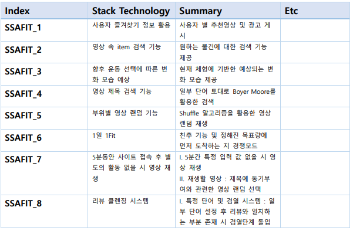

README.md

# Ssafit_DB 관통 프로젝트 - 2024 - 04 - 12

## 프로젝트 계획 이유

> - 이전에 완성한 SSAFIT 홈페이지에서 구현할 수 있는 기능들에 대해 생각할 수 있다.
> - 구현하고자 하는 기능들에 적용할 수 있는 알고리즘을 파악한다.
> - 파악한 알고리즘을 구현하기 위한 기술 Stack 및 적용 가능성에 대해 탐색한다.
> - 같은 팀원인 xxx는 대체 무슨 역할을 수행한지 의문을 가지며...

---

## 1. 팀원

- 문범수[Main], 박예본[Idol]

---

## 2. Stack Technology

>  ###  관련 기능
>
> 1) 사용자 즐겨찾기 정보 활용
>   * ➢ 사용자의 즐겨찾기 목록을 분석하여 관심 주제 및 선호도를 파악합니다. 
> 
>   * ➢ 이를 통해 가중치 입력 기반의 추천 영상을 제공합니다. 
> 
>   * ➢ 이를 위해 YouTube API를활용하여 관련 동영상을 검색하고, 즐겨찾기한 영상 의 
>        카테고리와 유사한 주제의 광고를 사용자에게 제공합니다.
>    ---
> 2) 영상 속 Item 검색 기능
>   * ➢ 영상 속에서 아이템을 검색하기 위해 객체 검출 및 추적 기술 (Faster RCNN, YOLO)과 
>        특징 기반 검색 기술(SIFT, SURF, ORB)을 사용합니다.
>    ---
>   
> 3) 향후 운동 선택에 따른 변화 모습 예상
>   * ➢ 컴퓨터 비전 기술을 이용하여 현재 몸의 상태를 분석하고, 향후 운동 선택에 따른 
>         변화를 예측합니다. 
> 
>   * ➢ LSTM, RNN 등의 딥러닝 알고리즘을 사용하여 모델을 학습하고, 소모되는 칼로리 정보를 
>         기반으로 예상 값을 출력합니다.
>    ---
>
> 4) 영상 제목 검색 기능
>   * ➢ 영상 제목 검색을 위해 Boyer-Moore 알고리즘을 사용하여 일부 단어를 기반으로 
>         연관성이 가장 높은 영상을 검색합니다.
>    ---
> 5) 부위별 영상 랜덤 기능
>   * ➢ 부위별 영상 랜덤 기능을 구현하기 위해 Shuffle 알고리즘을 활용하여 영상을 
>        재생합니다.
>    ---
> 6) 1일 1Fit
>   * ➢ 친구 추가 기능과 경쟁 모드를 통해 사용자들 간의 목표 달성을 유도합니다.
> 
>   * ➢ 이를 위해 친구 추가 기능과 목표 설정 기능을 제공합니다.
>    ---
>   
> 7) 5분 타이머 기능
>   * ➢ 사용자가 사이트에 접속한 후 5분간 활동이 없을 시 동기 부여 영상을 강제 재생합니다. 
>
>   * ➢ 이를 위해 일정 시간 동안 사용자의 활동 여부를 모니터링하고, 동기 부여와 관련된 
>        영상을 랜덤하게 선택하여 재생합니다
>   --- 
> 8) 리뷰 클렌징 기능
>   * ➢ 리뷰 클렌징 시스템을 구현하여 특정 단어나 문구가 포함된 리뷰를 검열합니다.
>
>   * ➢ 사용자가 설정한 단어나 문구와 일치하는 리뷰를 찾아 검열 단계로 이동합니다.
>    ---
> 
> ## 기능 Summary
> 

>     
> 

---

## 3. 기능 구현 및 서비스

> 1) 기본 기능
>
> - 메인페이지에서 보여질 영상정보를 조회
> - 운동 영상에 대한 리뷰를 관리
> - 구현하고자 하는 기능들에 대한 가능성 파악
>
> 2) 심화 기능
> - 아이디어를 실현하기 위한 필요 기능들 연구 필요
> - 각 과정들을 연계할 수 있는 방안 필요
>
> 3) 결과
> - 적용 가치가 높은 아이디어 선정 및 가능성에 대해 탐구함

---

## 4. 겪은 어려움

> - 지금까지 주어진 명세서의 의존해 기능을 구현하는데 그쳤다면 이번 시간에는 직접 아이디어 및 기능들을 생각해 구현을 해야 한다는 점이 어려웠음
> - 하고싶은 내용들은 많은데 직접 실현시키기에 어떤 기술이나 구체적인 방법이 떠오르지 않아 난항을 겪음
> - A형 시험을 치른 직후라 그런지 집중도가 그리 높지 않았음

---

## 5. 어려움 극복 방법

> - 최대한 기존에 존재하는 기능들을 벤치마킹하려 했으며, Youtube에서 많은 아이디어를 얻을 수 있었음
> - 어떤 프로젝트를 하더라도 AI를 빼놓고 진행하기가 어려울 정도로 최근 구현하고자 하는 많은 아이디어들은 인공지능 기술에 많이 의존함을 파악하고, 관련한 기술들을 많이 탐구함.
> - ___최대한 아디이어를 자유롭게 얘기했고, 다양한 주제로 뽑아낼 수 있었음___
---

## 6. 이후의 포부
> - 다시 웹페이지 설계부분을 복습하고, 향후 프로젝트에 적용하기 위한 기반을 확실히 다져야 겠다고 생각이 들었음.
> - AI 기술등에 대해 파악할 시간이 많이 필요해 보임
---

## 7. 기타 소감

> ### 1. 문범수
> - 다양한 아이디어를 생각하는 것도 어려웠지만 적용하는 기술들을 적절히 파악하는 것도 쉽지 않았음.
> - 막상 생각해낸 기능들이 이미 많이 구현되어 있는 내용들이었고, 공개 API 및 제공되는 코드들을 참고하는 방향으로 적용하는 연습을 해봐야겠다고 생각함.
>
> ### 2. 박예본
> - 흥미로운 경험이었습니다. 작은 기능이 어려울 수도 있고, 큰 기능이 쉽게 구현될 수 있다는 것을 발견했습니다.
> - 검색과 같은 기능은 SQL을 사용하거나 알고리즘을 통해 구현할 수 있어서 다양한 방법으로 데이터에 접근하고 가져올 수 있었습니다. 
> - 또한 이를 통해 여러 API를 활용하는 방법에 대해 배웠습니다.